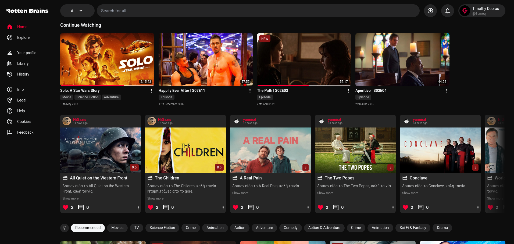
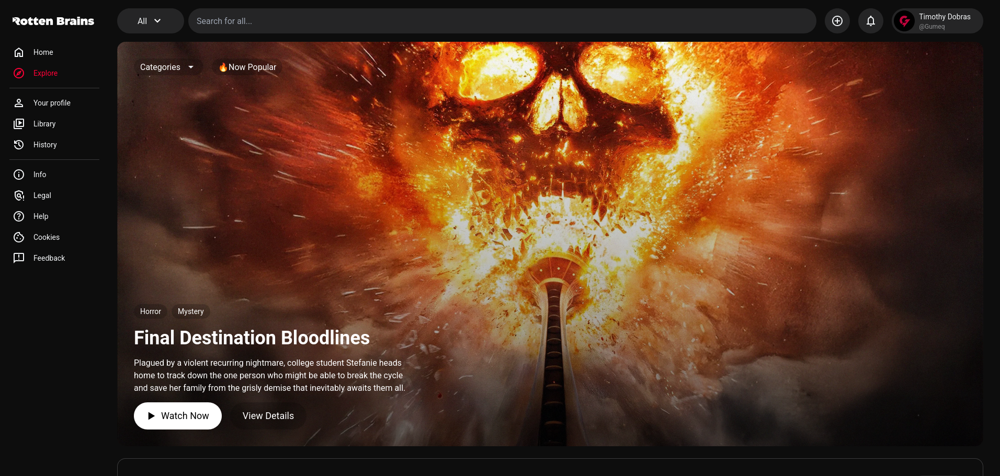
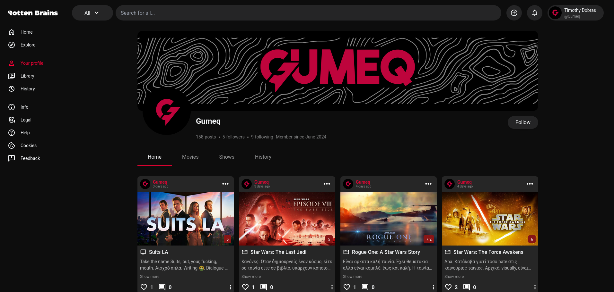
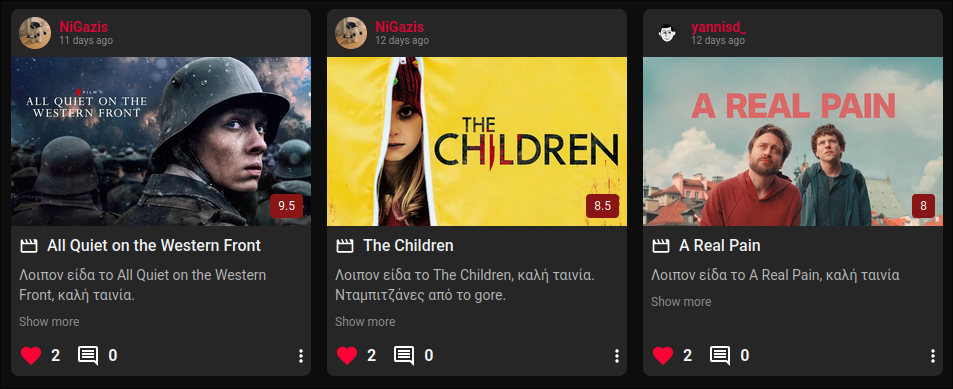
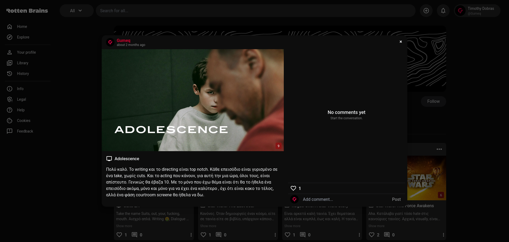
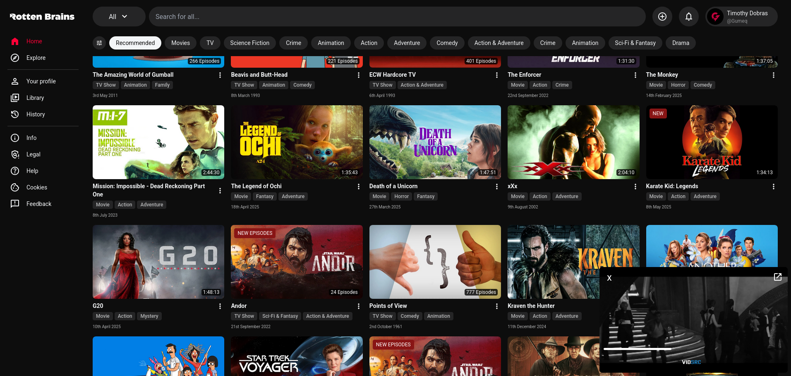
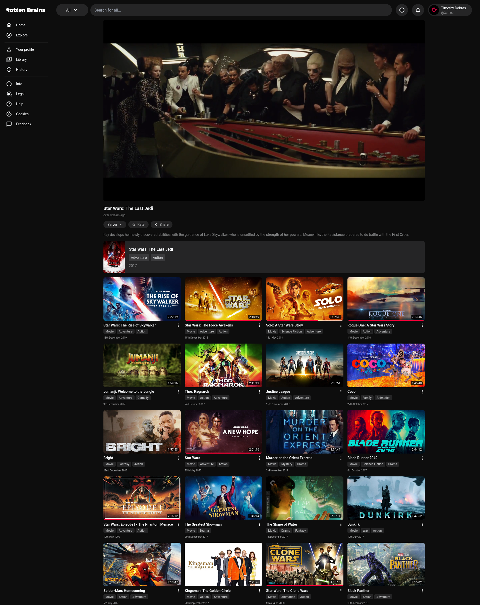
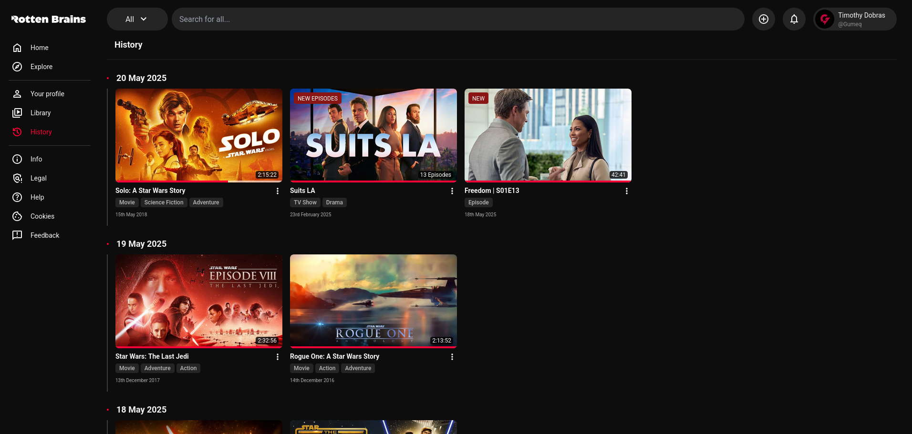

Welcome to **RottenBrains**, the ultimate social media platform for movie and TV show enthusiasts! Connect with friends, share reviews, and discover what to watch next through the collective wisdom of our community.

## Overview

RottenBrains is a vibrant social media website dedicated to movie and TV show reviews. Whether you're looking to share your thoughts on the latest blockbuster, find recommendations from friends, or dive deep into discussions about your favorite series, RottenBrains is the place for you.

## Features

- **User Profiles**: Create your profile, follow friends, and see what they're watching.
  
- **Movie and TV Show Reviews**: Write and share reviews for movies and TV shows. Rate them and provide your insights.
  
- **Social Interactions**: Like, comment, and save reviews. Engage in discussions with other movie and TV show fans.
  
- **Recommendations**: Get personalized recommendations based on your viewing history and reviews.
  
- **Watch**: Watch everything, for free.
  
- **Watch History**: View your watched media and continue watching where you left.
  

## Technologies Used

- **Next.js**: A powerful React framework for building server-side rendered applications.
- **TypeScript**: A statically typed superset of JavaScript that adds types for enhanced development experience and robustness.
- **Tailwind CSS**: A utility-first CSS framework for rapidly building custom user interfaces.
- **Supabase**: An open-source Firebase alternative for managing our database, authentication, and real-time subscriptions.
